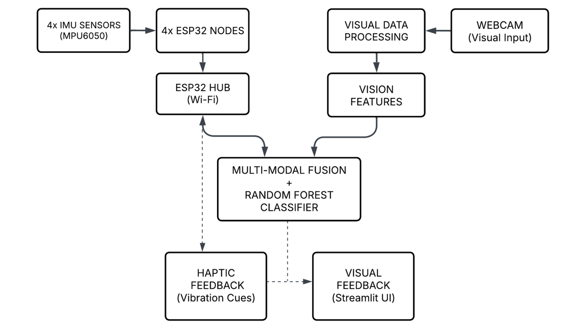
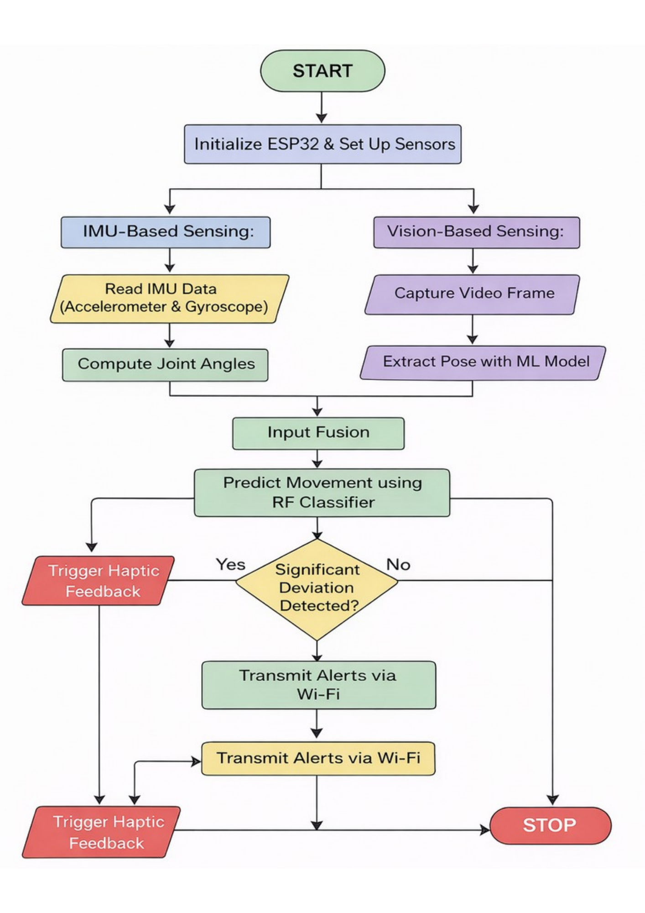
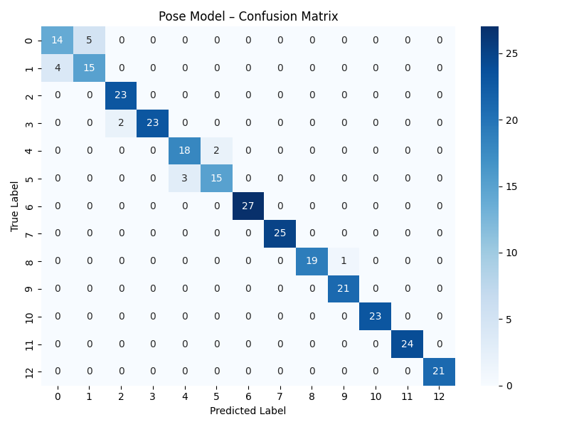
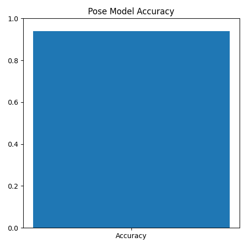

# 🧠 PhysioGuide - AI-Powered Rehabilitation Monitoring System
> A low-cost, real-time hybrid sensing system combining IMU and computer vision for scalable rehabilitation monitoring.

## 🚀 Overview

PhysioGuide is an end-to-end rehabilitation monitoring system that combines **Inertial Measurement Unit (IMU) sensor data** and **computer vision** to analyze exercise performance and provide real-time feedback.

Originally conceptualized as a multi-IMU wearable, this project evolved into a **multi-modal AI system** integrating sensor fusion, machine learning, and pose estimation for intelligent rehabilitation support.

---

## 🎯 Problem Statement

Traditional rehabilitation systems lack real-time feedback and accessibility, especially for home-based therapy. This project aims to bridge that gap by combining low-cost sensing (IMU) with AI-driven analysis to provide continuous, intelligent monitoring.
---

## 🧠 System Architecture

```text
IMU Sensors (ESP32 / Data Streams)
        ↓
Sliding Window Segmentation
        ↓
Feature Engineering (Statistical + Frequency Domain)
        ↓
ML Models (Random Forest Classifiers)
        ↓
Pose Estimation (MediaPipe - Vision Pipeline)
        ↓
Fusion Logic (Decision Engine)
        ↓
Real-Time Feedback + Dashboard (Streamlit)
```

<p align="center">
  
  <br/>
  <em>Figure: Multi-modal fusion architecture combining IMU and vision pipelines</em>
</p>

## 🔄 Methodology Pipeline

<p align="center">
  
</p>

---

## 🔑 Key Contributions

* Designed a **39-dimensional IMU feature space** incorporating statistical and frequency-domain features (mean, RMS, skewness, FFT, etc.)
* Built a **real-time inference pipeline** using sliding window segmentation
* Implemented **multi-class exercise classification** and **binary correctness detection**
* Integrated **computer vision (MediaPipe)** for pose-based validation
* Developed a **fusion-based decision system** combining IMU and vision outputs
* Created an **interactive Streamlit dashboard** for monitoring and visualization

---

## ⚙️ Tech Stack

* **Languages:** Python
* **ML:** scikit-learn (Random Forest)
* **Computer Vision:** OpenCV, MediaPipe
* **Data Processing:** NumPy, Pandas
* **Frontend / UI:** Streamlit
* **Hardware (conceptual / integration):** ESP32, IMU sensors

---

## 📊 Results

The system demonstrates strong performance across multiple components:

* **IMU Correctness Classification:** ~99% accuracy on windowed test data
* **Exercise Classification:** ~97–98% accuracy across multiple classes
* **Pose Model:** ~94% accuracy

📌 Detailed evaluation:

* Confusion matrices
* Accuracy plots
  → Available in the `results/` directory

<p align="center">
  
  
</p>

---

## ⚠️ Evaluation Note

Results are computed on windowed datasets. Due to potential overlap between training and test samples, performance may be optimistic.

Future work includes:

* Subject-wise cross-validation
* Real-world deployment validation

---

## 📁 Project Structure

```text
physioguide-ai/
│
├── src/                # ML pipeline, training, inference
│   ├── data processing
│   ├── feature engineering
│   ├── model training
│   └── real-time engine
│
├── results/            # Evaluation outputs (graphs, confusion matrices)
│
├── app.py              # Main application (pose + system logic)
├── dashboard.py        # Streamlit dashboard
├── espnow_controller.py # Sensor integration logic
├── requirements.txt
```

---

## 🔄 How It Works

1. IMU data is collected and segmented using sliding windows
2. Features are extracted (statistical + frequency domain)
3. ML models classify:

   * Exercise type
   * Correct vs incorrect execution
4. Pose estimation validates body posture using camera input
5. Outputs are fused to generate final feedback
6. Results are displayed in real-time via dashboard

---

## 🔮 Future Work

* Improve generalization using **subject-wise validation**
* Deploy as a **real-time web/mobile application**
* Integrate **live IMU streaming from wearable devices**
* Replace classical ML with **deep learning (LSTM / Transformers)**
* Add **personalized rehabilitation feedback system**

---

## 🧩 Applications

* Physiotherapy monitoring
* Stroke rehabilitation support
* Home-based fitness tracking
* Smart wearable systems

---

## 📌 Note

* Datasets and trained model files are not included due to size and privacy constraints
* This repository focuses on **system design, ML pipeline, and integration logic**

---

## 🙌 Acknowledgment

Built as part of an exploration into **AI + IoT + Human Motion Analysis**, with a focus on real-world rehabilitation applications.
