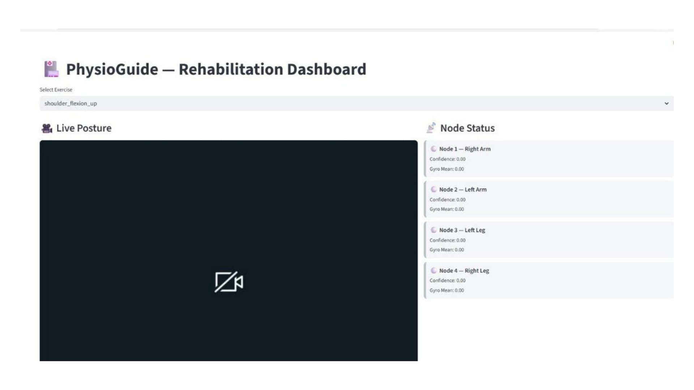
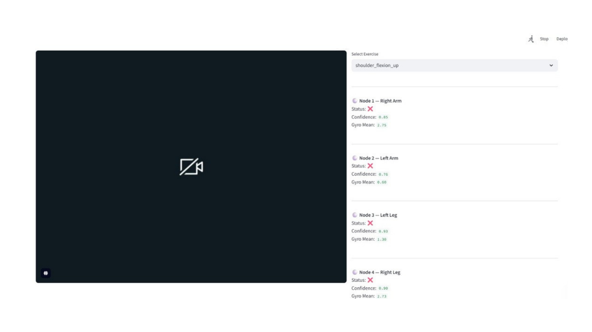

# 🧠 PhysioGuide - AI-Powered Rehabilitation Monitoring System
🚀 Real-time multi-modal rehabilitation system combining IMU + computer vision + ML

🏆 **2nd Place – National Level Project Competition (46+ teams)**
📍 Presented at HKBK College of Engineering Technical Innovation Event ([TechKubik Platform](https://hkbk.techkubik.in/))

A low-cost, real-time hybrid sensing system combining **IMU sensors and computer vision** for scalable, intelligent rehabilitation monitoring.

---

## ⚡ What This System Does

* Detects rehabilitation exercises using IMU sensor data
* Evaluates whether exercises are performed **correctly or incorrectly**
* Uses **pose estimation** to validate body posture
* Combines IMU + vision outputs using a **fusion decision system**
* Provides **real-time corrective feedback** via an interactive dashboard

---

## 🎯 Problem Statement

Traditional rehabilitation systems suffer from:

* Lack of real-time feedback
* Limited accessibility for home-based therapy
* High dependence on clinical supervision
* Poor scalability for continuous monitoring

This project addresses these gaps by building a **low-cost, AI-powered rehabilitation monitoring system** that works in real time.

---

## 🚀 Overview

PhysioGuide is an end-to-end **multi-modal machine learning system** integrating:

* **Inertial sensing (IMU data)**
* **Computer vision (pose estimation)**
* **Machine learning classification**
* **Decision-level fusion**

Originally conceptualized as a wearable IMU-based system, it evolved into a **hybrid AI pipeline** capable of analyzing both motion data and visual posture simultaneously.

---

## 🧠 System Architecture

```text
IMU Sensors (ESP32 / Data Streams)
        ↓
Sliding Window Segmentation
        ↓
Feature Engineering (Statistical + Frequency Domain)
        ↓
ML Models (Random Forest Classifiers)
        ↓
Pose Estimation (MediaPipe - Vision Pipeline)
        ↓
Fusion Logic (Decision Engine)
        ↓
Real-Time Feedback + Dashboard (Streamlit)
```

<p align="center">
  
  <br/>
  <em>Multi-modal fusion architecture combining IMU and vision pipelines</em>
</p>

---

## 🔄 Methodology Pipeline

<p align="center">
  
</p>

---

## 🧪 Sample Output

**Input:**

* Exercise: Knee Flexion
* IMU Sensor Stream + Camera Feed

**Output:**

* Detected Exercise: Knee Flexion
* Execution Quality: Incorrect
* Feedback: *"Increase knee bend angle and maintain posture alignment"*

---

## 🔑 Key Contributions

* Designed a **39-dimensional IMU feature space** (statistical + frequency domain features such as mean, RMS, skewness, FFT)
* Built a **real-time inference pipeline** using sliding window segmentation
* Implemented:

  * Multi-class exercise classification
  * Binary correctness detection
* Integrated **MediaPipe pose estimation** for posture validation
* Developed a **fusion-based decision engine** combining IMU and vision outputs
* Built an **interactive Streamlit dashboard** for real-time monitoring

---

## 👩‍💻 My Contribution

* Designed and implemented the **complete ML pipeline**
* Developed **feature engineering and model training workflows**
* Integrated **IMU + vision fusion logic**
* Built the **real-time inference system**
* Developed the **Streamlit dashboard for visualization and feedback**
* Handled **end-to-end system integration**

---

## ⚙️ Tech Stack

* **Languages:** Python
* **Machine Learning:** scikit-learn (Random Forest)
* **Computer Vision:** MediaPipe, OpenCV
* **Data Processing:** NumPy, Pandas
* **Frontend/UI:** Streamlit
* **Hardware (conceptual/integration):** ESP32, IMU Sensors

---

## 📊 Results

The system demonstrates strong performance:

* **IMU Correctness Classification:** ~99% accuracy
* **Exercise Classification:** ~97–98% accuracy
* **Pose Estimation Model:** ~94% accuracy

📌 Evaluation outputs include:

* Confusion matrices
* Accuracy plots

<p align="center">
  
  
</p>

---

## ⚠️ Evaluation Note

* Results are computed on **windowed datasets**
* Overlap between training and test samples may inflate accuracy

**Note:** High accuracy may not fully reflect real-world deployment performance

---

## 🖥️ System Output

### 📊 Real-Time Dashboard

Displays:
- Live posture tracking (camera input + pose estimation)
- Exercise classification
- Correct/incorrect execution detection
- Node-wise IMU sensor status



---

### ⚠️ Feedback & Prediction Output

Shows:
- Per-node confidence scores
- Incorrect movement detection
- Real-time feedback signals for correction



---

These screenshots demonstrate real-time system inference, classification, and feedback generation without requiring hardware deployment.

---

## 📁 Project Structure

```text
physioguide-ai/
│
├── src/                # ML pipeline, training, inference
│   ├── data processing
│   ├── feature engineering
│   ├── model training
│   └── real-time engine
│
├── results/            # Evaluation outputs
├── assets/             # Architecture diagrams
│
├── app.py              # Main application logic
├── dashboard.py        # Streamlit dashboard
├── espnow_controller.py # Sensor integration logic
├── requirements.txt
```

---

## 🔄 How It Works

1. IMU data is collected and segmented into time windows
2. Features are extracted (statistical + frequency domain)
3. ML models classify:

   * Exercise type
   * Correct vs incorrect execution
4. Pose estimation validates body posture
5. Fusion logic combines both outputs
6. Real-time feedback is displayed via dashboard

---

## 🧩 Applications

* Physiotherapy monitoring
* Stroke rehabilitation support
* Home-based fitness tracking
* Smart wearable healthcare systems

---

## 🔮 Future Work

* Subject-wise validation for improved generalization
* Real-time deployment with live IMU streaming
* Deep learning models (LSTM / Transformers)
* Personalized rehabilitation feedback system
* Mobile/web application deployment

---

## 📌 Note

* Dataset and trained model files are **not included** due to size and privacy constraints
* This repository focuses on:

  * System design
  * ML pipeline
  * Integration logic

---

## 🙌 Acknowledgment

Developed as part of a research-driven exploration in:

**AI + IoT + Human Motion Analysis**

Focused on building **practical, scalable rehabilitation solutions** for real-world use.
